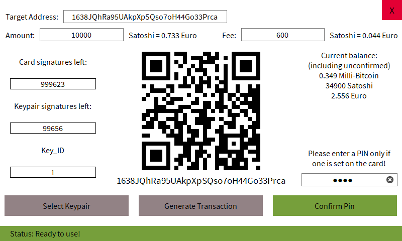

# Praesidium
Praesidium is an open source, easy-to-use bitcoin wallet for Blockchain Security 2Go cards written in Python. It is made for consumers and developers that want to experience almost all of the cards functionalities in a fast and intuitive GUI.

More pictures can be found below under [Screenshots](#Screenshots).

## Features
Praesidium enables you to do a lot of things with your Blockchain Security 2Go card:

* Generate new keypairs
* List all avaliable keypairs
* Show your Bitcoin address (also in form of a QR code)
* Unlock the card via a PIN
* Show how many Bitcoins you possess
* Generate and broadcast a transaction
* Log each transaction made in a text file

If you want to learn Bitcoin on a low level the transaction logs even show you how each transaction was built byte for byte.

**IMPORTANT:** Praesidium currently does not support P2SH or Segwit transactions!

## Installation
To install Praesidium either clone this repository or download the [Praesidium](praesidium) folder to your machine.

Please note that this software is inteded for use with Python 3. It was tested and build on Python version 3.6.8.
It does not support Python 2 and there are currently no plans to support it!

### Dependencies
Praesidium uses a total of 4 dependencies which do not come nativly with python:

* [Base58](https://github.com/keis/base58)
* [Blocksec2go](https://github.com/Infineon/BlockchainSecurity2Go-Python-Library)
* [PySide2](https://www.qt.io/qt-for-python)
* [Qrcode](https://github.com/lincolnloop/python-qrcode)

You can use the PIP installer (for Python 3!) to install most these dependencies, the blocksec2go library requires additional steps:

#### Base58:

    pip install base58

#### Blocksec2go:
To install the blocksec2go python library i recommend you follow this [installation guide](https://github.com/Infineon/BlockchainSecurity2Go-Python-Library#install-prerequisites) since this library uses the [pyscard](https://github.com/LudovicRousseau/pyscard) library which requieres [swig](http://www.swig.org/).

If you are on Windows and already have [chocolately package manager](https://chocolatey.org) installed you can do the next to steps to install the blocksec2go library:

    choco install swig
    pip install blocksec2go

#### Qt for Python:

    pip install pyside2

#### Qrcode:

    pip install qrcode

## Usage
To start the application go into the praesidium folder and run the following command:

    python praesidium.py

If you are not using the 'Identiv uTrust 3700 F' reader (which you most probably are not) then change the string in line 24 inside `praesidium.py` to your readers name:

    reader_name = 'Identiv uTrust 3700 F'

If you do not know your readers name you can run the command `blocksec2go list_readers` in your terminal/cli after installing the blocksec2go library. This will show you a list of readers connected to your system. You do not need to copy the full name of the reader, but you should keep in mind that Praesidium chooses the first reader from that list with the name you entered in line 24. So if you have multiple readers connected with the same name it is recommended you either enter the full name of the reader in `reader_name` or you disconenct all other readers except for the one you intend on using. 

TLDR: Change the value of the `reader_name` variable to your readers name and remember that Praesidium does not support multiple readers with the same name (It uses the "first" reader with that name and ignores the others)!

## License
The source code is licensed under GPLv3. The license is available [here](LICENSE).

The [PySide2](https://doc.qt.io/qt-5/licensing.html) library is licenced under [LGPLv3](https://doc.qt.io/qt-5/lgpl.html). The source code of this library was not modified in any way for this project. You can find the source code for PySide2 [here](https://download.qt.io/official_releases/QtForPython/).

## Screenshots
Default start screen:
![Screenshot][Nocard window 1]

Blockchain Security 2Go card gets placed on reader:
![Screenshot][Nocard window 2]

Another card, that is not a Blockchain Security 2Go card, gets placed on the reader:
![Screenshot][Nocard window 3]

A full Keypair screen:
![Screenshot][Keypair 1]

Before there were 27 keypairs and now a new keypair (Keypair 28) gets generated:
![Screenshot][Keypair 2]

Keypair 29 was entered in the `Keypair number` box, which not a valid keypair because it has not been generated yet:
![Screenshot][Keypair 3]

Main window of Keypair 1 with PIN already entered correctly:
![Screenshot][Main window 1]

A wrong PIN is entered (Note that a PIN can only be entered 3 times incorrectly, after that the card is locked and has to manually be unlocked via the command line and the PUK):
![Screenshot][Main window 2]

Balance on this Bitcoin address is too low to sucessfully pay the desired amount to the target address:
![Screenshot][Main window 3]

The returned change falls under the minimum amount of Satoshi required to make a transaction (This means either the fees can be increased, which the program does by default, or the amount can be increased or more balance can be added to this address so that the returned change is above the threshhold):
![Screenshot][Main window 4]

A broadcastable transaction is generated and you can choose to broadcast or store it (This is done in case you want to push the transaction manually or at a later time):
![Screenshot][Main window 5]

[Nocard window 1]: img/screenshot_nocard_waiting.png "Waiting for a card"
[Nocard window 2]: img/screenshot_nocard_right_card.png "Blockchain Security 2Go card inserted"
[Nocard window 3]: img/screenshot_nocard_wrong_card.png "Not a Blockchain Security 2Go card"
[Keypair 1]: img/screenshot_keypairs.png "Keypair window"
[Keypair 2]: img/screenshot_keypairs_new_keypair.png "Generated a new keypair"
[Keypair 3]: img/screenshot_keypairs_invalid_keypair.png "Invalid Keypair - Not generated yet"
[Main window 1]: img/screenshot_1.png "Main window"
[Main window 2]: img/screenshot_2_PIN_wrong.png "Wrong PIN was entered"
[Main window 3]: img/screenshot_3_balance_too_low.png "Blance too low for entered transaction"
[Main window 4]: img/screenshot_4_change_under_dust.png "Returned bitcoins would fall under dust"
[Main window 5]: img/screenshot_5_broadcast.png "Broadcast window"
